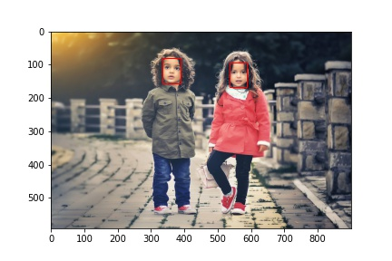

# Face Detection and Face Extraction

Face Detection and Extraction using pretrained `CNN` model.




## Installation

Download [Anaconda](https://docs.anaconda.com/anaconda/install/)

```bash
pip install keras
pip install mtcnn
pip install keras_vggface
```

## Usage

```python
def highlight_faces(image_path, faces):
  # display image
    image = plt.imread(image_path)
    plt.imshow(image)

    ax = plt.gca()

    # for each face, draw a rectangle based on coordinates
    for face in faces:
        x, y, width, height = face['box']
        face_border = Rectangle((x, y), width, height,
                          fill=False, color='red')
        ax.add_patch(face_border)
    plt.show()
```

## Contributing
Pull requests are welcome. For major changes, please open an issue first to discuss what you would like to change.

Please make sure to update tests as appropriate.

## License
[MIT](https://choosealicense.com/licenses/mit/)
